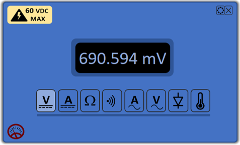

# pokitMeter-DMM-App

 
 
 ##	GENERAL INFORMATION

1.1	System Overview

Windows based application for pokitMeter for accessing DMM functions: 

* Voltage, Current, Resistance, Diode, Continuity, Temperature
* DMM configurations
   * voltage range
   * current range
   * ohmmeter range
   * temperature scale
* DSO  and Data Logger functions:
   * Under development
* Written in Python

1.2	Core Components
* Python 3.7
* PyQt5
* Bleak

1.3	Platform
* Windows 10
* GUI is created using Qt Designer
* Exe is created using PyInstaller
